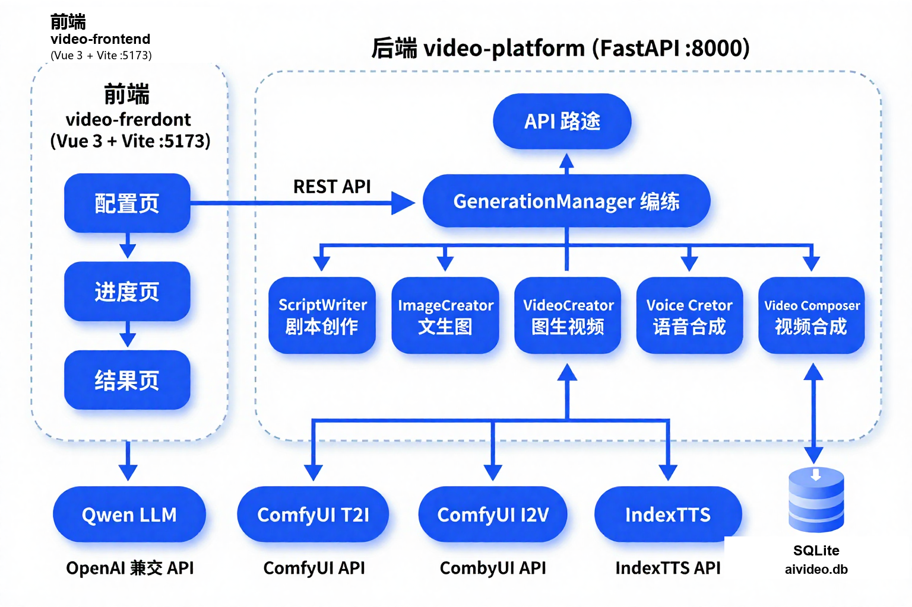

# 🎬 aivideo_v2 — 一站式全流程 AI 长视频创作平台

> 输入一个主题，系统自动完成「剧本创作 → 文生图 → 图生视频 → 语音合成 → 视频合成」全链路，一键输出可预览、可下载的成品视频。
>
> One-stop AI long-video creation platform: from a single topic prompt to a finished video, fully automated.


---

## 🚀 项目最大亮点

> **可本地部署的 AI 长视频创作平台** —— 大语言模型、文生图、图生视频、语音合成**全链路模型均支持本地化部署**，**无须申请任何第三方平台 API 接口**，**0 成本创作 AI 长视频**。

| AI 能力 | 本地化模型 | 说明 |
|:--------|:-----------|:-----|
| 大语言模型 | Qwen（llama.cpp 推理） | 剧本创作、分镜规划 |
| 文生图 | z-image-turbo（ComfyUI） | 分镜画面生成 |
| 图生视频 | Wan2.2 I2V（ComfyUI） | 分镜动态视频生成 |
| 语音合成 | IndexTTS | 多音色配音 + 情感控制 |

- 🏠 **全本地部署**：四大 AI 模型均可部署在本机，数据不出本地
- 🔌 **零 API 依赖**：无需申请/购买第三方平台 API Key，无额度限制、无调用计费
- 💰 **0 成本创作**：一次性硬件投入，长期零边际成本，无限次创作
- 🔒 **隐私安全**：剧本/图片/视频/配音数据全程保存在本地
- 📴 **可离线运行**：无网络环境也能完成全部创作流程

---

## ✨ 功能特性

- **一键成片**：仅需输入主题 + 简单配置（比例 / 风格 / 时长），无需任何剪辑技能
- **5 大 AI Agent 流水线编排**：剧本 → 分镜图片 → 视频片段 → 配音 → 字幕合成，全程无人工干预
- **分镜级数据持久化**：image / video / voice 按分镜逐条增量写入 SQLite，容错性与可观测性兼备
- **丰富生成参数**：16:9 / 9:16 / 1:1 画面比例，360p / 720p / 1080p 横竖屏，16 / 24 / 30 fps，8 种画面风格（写实 / 动画 / 动漫 / 3D / 赛博朋克 / 水墨 / 像素 / 油画）
- **多音色配音**：7 种本地参考音色（IndexTTS），支持分镜级配音与情感控制
- **实时进度**：前端每 3 秒轮询后端状态，五步生成进度一目了然
- **项目管理**：历史项目、分镜画廊、重新生成，创作过程可回溯
- **教程中心**：内置 Markdown 教程自动导入，开箱即学
- **系统设置页**：外部服务参数可视化配置 + 一键连通性测试
- **本地优先**：数据存于本地 SQLite，可完全离线运行（FFmpeg 需自行下载配置，见「快速开始」）

---

## 🏗️ 系统架构



### 五步生成管线

| 步骤 | Agent | 职责 | 依赖服务 |
|:----:|:------|:-----|:---------|
| 1 | ScriptWriter | 生成多分镜剧本（画面描述、旁白、字幕、中英文提示词、镜头语言） | Qwen LLM |
| 2 | ImageCreator | 为每个分镜生成图片 | ComfyUI 文生图（z-image-turbo） |
| 3 | VideoCreator | 将分镜图片转为视频片段 | ComfyUI 图生视频（Wan2.2 I2V） |
| 4 | VoiceActor | 为分镜旁白生成配音并合并 | IndexTTS |
| 5 | VideoComposer | 拼接片段 + 混音配音/BGM + 合成字幕，输出成片 | FFmpeg |

---

## 🧩 技术栈

| 端 | 技术 |
|:---|:-----|
| 后端 | Python · FastAPI · Uvicorn · SQLite |
| 前端 | Vue 3 · TypeScript · Vite · Pinia · Vue Router · Tailwind CSS · md-editor-v3 |
| AI 服务 | Qwen（llama.cpp / OpenAI 兼容 API）· ComfyUI（T2I / I2V）· IndexTTS |
| 媒体处理 | FFmpeg（自行下载配置，见「快速开始」） |

---

## 🚀 快速开始

### 环境要求

- Python 3.10+
- Node.js 20.19+（或 22.12+，Vite 8 要求）
- **FFmpeg（必装，视频合成/音频时长读取依赖）**，二选一：
  - 方式一（推荐）：下载 `ffmpeg.exe` / `ffprobe.exe` 放入项目 `video-platform/bin/` 目录（仓库不随附二进制）
  - 方式二：安装 FFmpeg 并将 `bin` 目录加入系统 `PATH`（如 `winget install ffmpeg` / 官网 [ffmpeg.org/download.html](https://ffmpeg.org/download.html)）
  - > 程序按「内置 `bin` 目录 → 系统 `PATH`」顺序查找，两者均未配置时会报错提示
- 可用的外部 AI 服务（可远程，见下方配置）：
  - Qwen 推理服务（OpenAI 兼容接口）
  - ComfyUI 服务（含文生图、图生视频工作流）
  - IndexTTS 语音合成服务

### Windows 一键启动

```bat
start.bat
```

脚本自动完成：前端依赖检查安装 → 启动 API 后端（优先使用 `.venv`）→ 启动前端开发服务器。

### 手动启动

```bash
# 1. 后端
python -m venv .venv
.venv\Scripts\activate          # Windows；macOS/Linux 使用 source .venv/bin/activate
pip install -r requirements.txt
python main.py

# 2. 前端
cd video-frontend
npm install
npm run dev
```

### 访问入口

| 入口 | 地址 |
|:-----|:-----|
| 前端工作台 | http://localhost:5173 |
| 后端 API | http://localhost:8000 |
| API 文档（Swagger） | http://localhost:8000/docs |

---

## ⚙️ 外部服务配置

在系统「设置」页或 SQLite `settings` 表中配置（以下为配置键名）：

| 分组 | 配置键 | 说明 |
|:-----|:-------|:-----|
| LLM | `llm_api_base` / `llm_api_key` / `llm_model` / `llm_timeout` | Qwen 推理服务（OpenAI 兼容） |
| 文生图 | `t2i_url` / `t2i_token` / `t2i_timeout` / `t2i_poll_interval` | ComfyUI 文生图接口 |
| 图生视频 | `i2v_url` / `i2v_token` / `i2v_timeout` / `i2v_poll_interval` | ComfyUI 图生视频接口 |
| 语音合成 | `tts_base_url` / `tts_username` / `tts_password` | IndexTTS 服务 |

设置页支持一键连通性测试（`/api/settings/test/{vendor}`），保存后立即生效。

---

## 📁 目录结构

```
aivideo_v2/
├── main.py                    # FastAPI 后端主入口（lifespan：建库 / 导教程 / 恢复中断项目）
├── start.bat                  # Windows 一键启动脚本
├── requirements.txt           # Python 依赖
├── video-platform/            # 后端核心
│   ├── agents/                # 5 大 AI Agent（script_writer / image_creator / video_creator / voice_actor / video_composer）
│   ├── api/                   # 路由：auth / projects / assets / tutorials / settings
│   ├── models/                # 数据模型（Project / Scene / VoiceStyle / TaskStatus）
│   ├── services/              # db / llm_client / comfyui_img / comfyui_vid / ffmpeg_utils / generation / ...
│   └── bin/                   # FFmpeg（可选：将下载的 ffmpeg.exe / ffprobe.exe 放入此处，或配置系统 PATH）
├── video-frontend/            # 前端（Vue 3 + Vite + TS + Tailwind）
├── static/speaker/            # 音色参考音频（随项目分发）
├── doc/                       # 项目文档（需求 / 设计 / 开发手册 / 测试报告）
├── sqlite/                    # SQLite（aivideo.db，运行生成）
├── output/                    # 生成产物（视频 / 图片 / 音频）
└── upload/                    # 上传资产
```

### 数据库表

`admin` · `projects` · `scenes`（分镜）· `assets`（资产）· `tutorials`（教程）· `settings`（配置）

---

## 📚 文档

项目文档位于 [`doc/`](doc/)，包括：

- 项目开发手册
- V2.0 系统设计文档 / 需求基线 PRD / 新版需求文档
- 系统架构说明 / API 对接说明
- V2.0 QA 测试报告
- 语音驱动视频时长变更说明
- 类图 / 时序图（Mermaid）

---

## 📄 许可证

本项目基于 [MIT License](LICENSE) 开源。

> 提示：本项目集成的外部 AI 服务（Qwen / ComfyUI / IndexTTS）及分发组件（FFmpeg）均为各自独立的开源项目，请遵循其对应的许可证条款。
