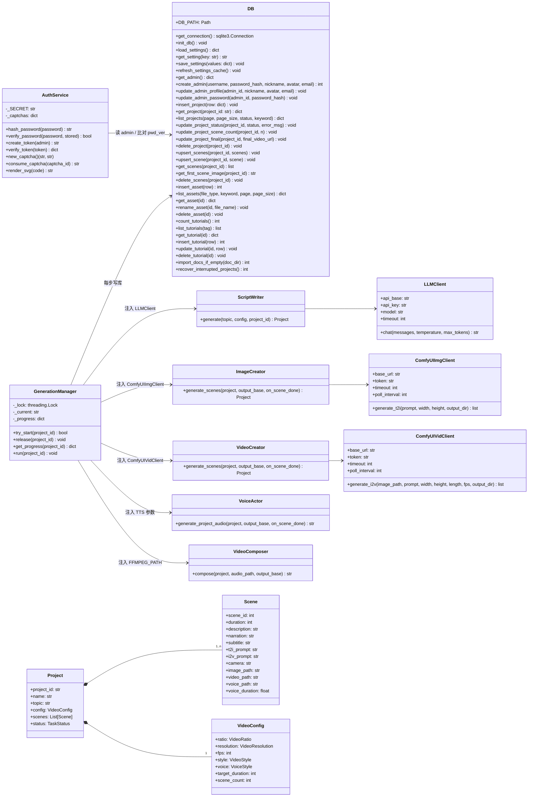
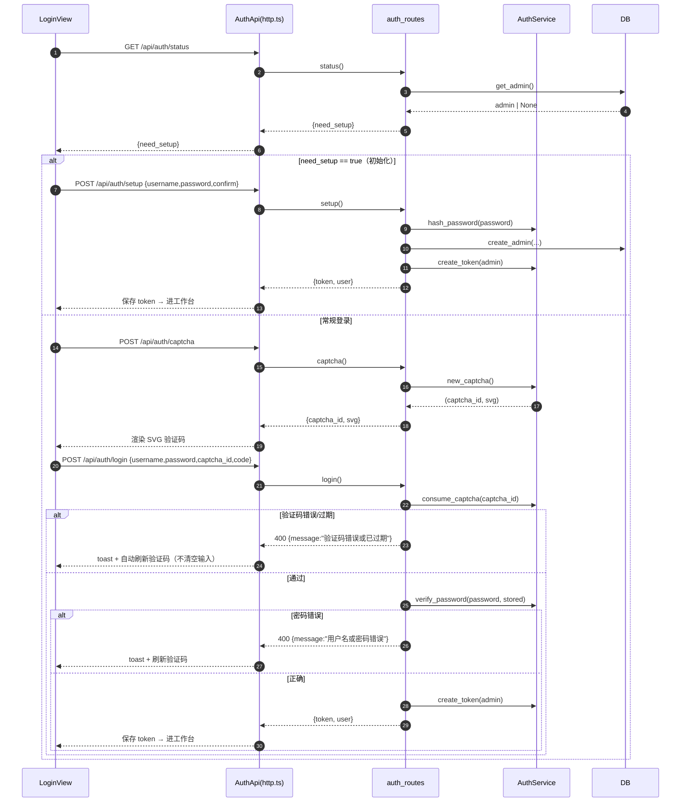
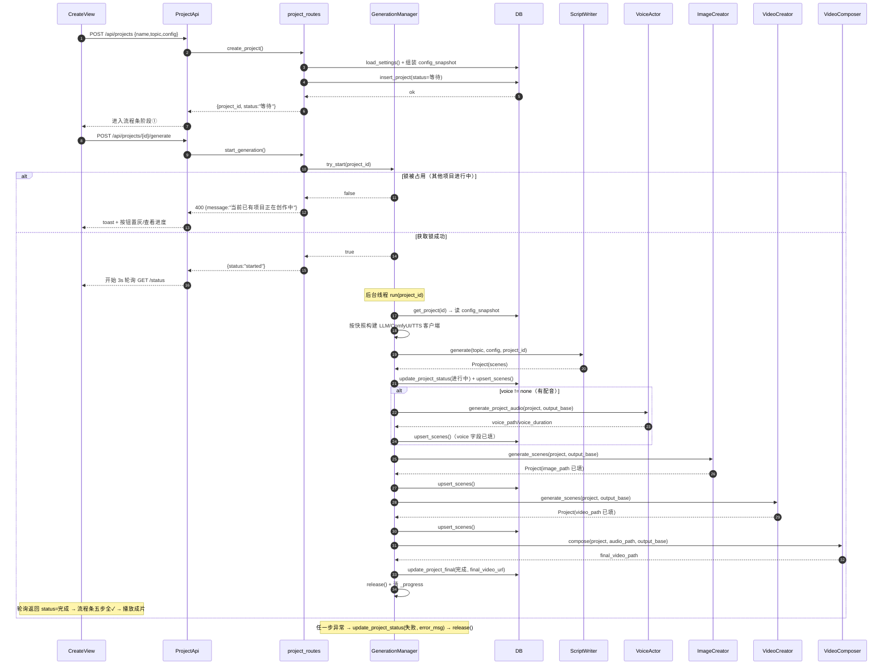
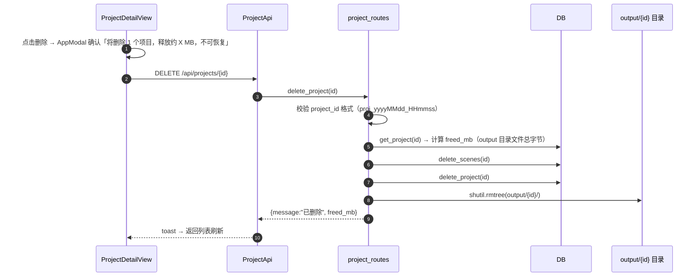
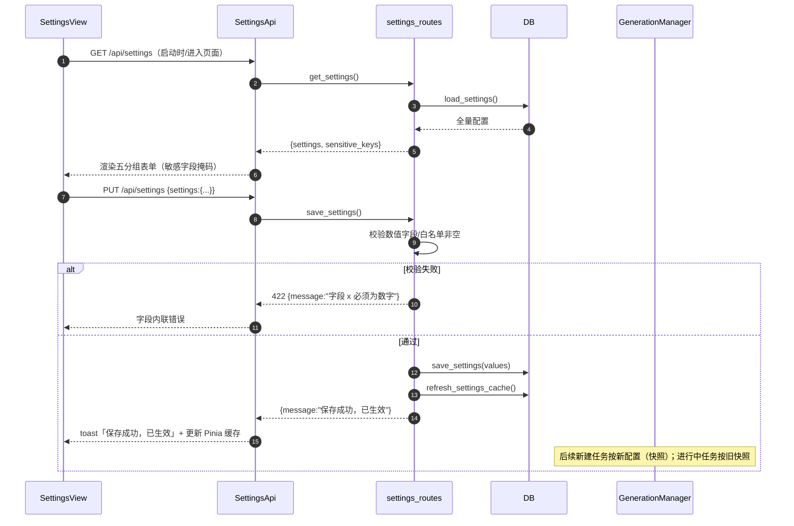
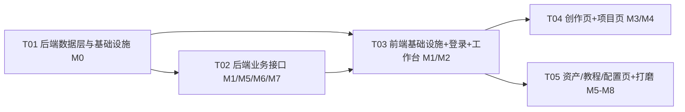

# 视频智造平台 — 系统架构说明文档

> **项目名称：** 本地视频智造平台（英文简称 aivideo）
> **项目代号：** aivideo_v2
> **文档版本：** v2.0（合并稿）
> **编制日期：** 2026-08-25
> **文档状态：** ✅ 定稿
> **用途：** 工程师实现依据（含任务分解与验收要点）；QA 验收依据

---

## 目录

1. [架构总览](#1-架构总览)
2. [关键设计决策](#2-关键设计决策)
3. [技术选型](#3-技术选型)
4. [后端架构设计](#4-后端架构设计)
5. [前端架构设计](#5-前端架构设计)
6. [数据结构（类图）](#6-数据结构类图)
7. [核心流程（时序图）](#7-核心流程时序图)
8. [数据流与工作流](#8-数据流与工作流)
9. [部署架构](#9-部署架构)
10. [安全架构](#10-安全架构)
11. [异常处理与容错](#11-异常处理与容错)
12. [性能架构](#12-性能架构)
13. [文件清单](#13-文件清单)
14. [共享约定](#14-共享约定)
15. [风险与待确认](#15-风险与待确认)
16. [任务分解参考](#16-任务分解参考)

---

## 1. 架构总览

### 1.1 总体架构图

```
┌─────────────────────────────────────────────────────────┐
│                   用户浏览器 (Web UI)                     │
│         Vue 3.5 + Vite + TS + Pinia + Axios (:5173)      │
│   登录页 / 工作台框架（创作 / 项目 / 资产 / 教程 / 配置）  │
└────────────────────────┬────────────────────────────────┘
                         │ HTTP REST API (JSON)
                         ▼
┌─────────────────────────────────────────────────────────┐
│               FastAPI 后端 main.py (端口 8000)            │
│                                                          │
│  ┌───────────────────────────────────────────────────┐  │
│  │ API 路由层：auth / project / asset / tutorial /    │  │
│  │             settings / system / files / upload     │  │
│  └───────────────────────┬───────────────────────────┘  │
│  ┌───────────────────────▼───────────────────────────┐  │
│  │ 业务层：GenerationManager（单并发锁 + 五步编排 +   │  │
│  │         写库编排，services/generation.py）          │  │
│  │         AuthService（PBKDF2 / token / SVG 验证码）  │  │
│  └───────────────────────┬───────────────────────────┘  │
│  ┌───────────────────────▼───────────────────────────┐  │
│  │ 引擎层（Agents）：ScriptWriter → VoiceActor →      │  │
│  │   ImageCreator → VideoCreator → VideoComposer      │  │
│  └───────────────────────┬───────────────────────────┘  │
│  ┌───────────────────────▼───────────────────────────┐  │
│  │ 服务层：LLMClient / ComfyUIImgClient /             │  │
│  │   ComfyUIVidClient / VoiceActor / FFmpegUtils      │  │
│  │ 数据层：DB（SQLite DAO，services/db.py）            │  │
│  └───────────────────────────────────────────────────┘  │
└───────┬──────────────────────┬──────────────────────────┘
        │                      │
        ▼                      ▼
┌──────────────────┐   ┌────────────────────────────────┐
│ SQLite aivideo.db    │   │ 文件存储（非数据源，路径入库）    │
│ 唯一数据源        │   │ output/{id}/ 产物（images/videos/│
│ admin/projects/  │   │   audio/final）                  │
│ scenes/assets/   │   │ upload/{docs,images,media}/ 资产 │
│ tutorials/settings│  │ video-platform/bin/ ffmpeg/ffprobe│
└──────────────────┘   └────────────────────────────────┘
```

### 1.2 分层架构

| 层级 | 内容 | 说明 |
|:-----|:-----|:-----|
| **表现层** | Vue 3.5 + TS 组件 | 登录页、工作台框架、五页面（创作/项目/资产/教程/配置） |
| **接口层** | FastAPI REST API | CORS 中间件、Pydantic 校验、鉴权中间件（require_auth） |
| **业务层** | GenerationManager / AuthService | 五步管线编排 + 单并发锁 + 写库编排；认证服务 |
| **引擎层** | 5 个 Agent | ScriptWriter / VoiceActor / ImageCreator / VideoCreator / VideoComposer |
| **服务层** | LLMClient / ComfyUIImgClient / ComfyUIVidClient / VoiceActor / FFmpegUtils | 外部 AI 服务与本地工具封装 |
| **数据层** | DB（services/db.py） | SQLite 连接管理（WAL/busy_timeout）、六表 CRUD、settings 缓存、doc 导入、启动恢复 |
| **基础设施层** | SQLite / FFmpeg(内置 bin) / 文件系统 I/O | 数据与文件持久化 |

> **💡 架构亮点：** 全部 AI 能力（大语言模型 / 文生图 / 图生视频 / 语音合成）均由本地部署模型提供服务，外部依赖仅为内网服务地址（settings 表可配），无须第三方平台 API 接口，数据全程不出本地，可完全离线运行。

### 1.3 版本演进（架构角度）

| 版本 | 关键架构变更 |
|:----|:------------|
| V2.0 | SQLite 唯一数据源（废除 script.json）；认证 + 工作台 + 五页面；配置表化；单并发；删除级联；main.py 更名；FFmpeg 固定内置；分镜级实时写库（upsert_scene 单条 UPSERT + on_scene_done 回调，前端 3s 轮询即可实时看到分镜）；状态接口增强（等待态 + 内存进度时立即返回 script 阶段）；字幕 = 旁白；删除重试按钮；语音合成前置（script→voice→images→videos→compose）；分镜视频帧数由语音真实时长驱动；无配音模式 voice=none；字幕字号自适应 + 智能换行；分辨率前端只传等级、方向由比例补全 |

---

## 2. 关键设计决策

### 2.1 需求评审决策落地（①-⑤）

| # | 事项 | 结论（架构师定夺） |
|:--:|:-----|:------------------|
| ① | 教程初始导入 | **按定稿执行**：tutorials 表为空时自动导入 `doc/*.md` 全部文档、**不过滤**；用户删除全部教程后重启会再次导入，属文档规定行为（风险节已标注） |
| ② | 重启时「进行中」任务 | 新增启动钩子 `DB.recover_interrupted_projects()`：把 `status='进行中'` 的 projects 置为 `'失败'`，`error_msg='服务重启，生成中断，请重新生成'`。不尝试恢复（线程任务无法续跑） |
| ③ | token 方案 | **标准库自实现（hmac + hashlib 签名），零新增依赖**，7 天有效期。签名密钥启动时 `secrets.token_hex(32)` 生成（内存）；重启后旧 token 失效→重新登录（本地单用户可接受）。payload 含 `pwd_ver` |
| ④a | 改密/重置后强制重登 | **服务端密码版本号机制**：admin 表新增 `password_version`；改密/重置成功后 +1；token 携带 `pwd_ver`，校验时与 DB 不一致 → 401 → 前端全局拦截清 token 回登录页 |
| ④b | 分页参数 | 统一约定：`page`（默认 1）、`page_size`（项目默认 **12**、资产默认 **20**）；响应 `{items, total, page, page_size, has_more}`；排序 `created_at DESC, id DESC`；教程不分页 |
| ④c | 配置 GET 敏感掩码策略 | `GET /api/settings` 返回**原始值**（本地单用户 + localhost 传输可接受）；前端 `SensitiveInput` 以密码框渲染 + 显示/隐藏切换；掩码展示统一 `******`。预留开关：上公网改后端掩码 + PUT 遇占位符保留旧值 |
| ⑤ | 前端改造方式 | **原地升级 video-frontend**（不新建目录）：保留目录、vite 代理、start.bat 引用路径；`src/` 重写为 TS 目录结构；`vite.config.js` → `vite.config.ts`；删除旧 ConfigPanel/ProgressPanel/ResultPanel/api.js |

### 2.2 架构决策（D1-D8）

| # | 决策 | 说明 |
|:--:|:-----|:-----|
| D1 | **生成管线编排收拢到 `services/generation.py`（GenerationManager）** | Agent 保持"纯内存转换器"（只改 Project 对象），**写库由编排层统一执行**。避免 Agent 与 DB 循环依赖、Agent 可独立单测、写库点集中一处实现 |
| D2 | **创建时全量快照** | projects 表新增 `config_snapshot TEXT`（JSON）：创建项目时把 settings 全量 + 视频配置写入；生成时从快照构建 Agent 客户端参数，**Agent 不直接读 settings** |
| D3 | **admin 表新增 `password_version INTEGER DEFAULT 0`** | 配合强制重登（④a） |
| D4 | **必须新增 `python-multipart`** | FastAPI 上传接口（`POST /api/assets/upload` multipart）运行期必需——唯一新增后端运行时依赖 |
| D5 | **文件路径入库采用"相对项目根"** | DB 存相对路径（`output/proj_x/images/scene_001.png`、`upload/docs/xx.pdf`），访问 URL 由后端统一转换：产物 `/api/files/{path}`、资产 `/upload/{path}`；前端只用返回的 URL |
| D6 | **Agent 客户端每次生成按快照新建** | 不再用全局懒加载单例（`get_agents()` 废弃）；每次 generate 按该项目 config_snapshot 构建 LLM/ComfyUI/TTS 客户端，天然满足"进行中任务保持旧参数" |
| D7 | **`/api/system/status` 保留** | 健康检查（ComfyUI 状态），免鉴权，前端工作台"系统状态"小字使用 |
| D8 | **状态/进度分离** | `GET /api/projects/{id}/status`：状态字段以 **DB 为准**（等待/进行中/完成/失败），`current_step/progress_percent` 从内存进度 dict 合并（等待态 + 内存进度存在时也返回 step/progress）；DB 是唯一数据源，内存只是进度加速器 |

---

## 3. 技术选型

| 层 | 选型 | 版本 | 说明 |
|:----|:-----|:-----|:-----|
| 后端框架 | FastAPI + uvicorn | fastapi==0.138.1 / uvicorn==0.49.0 | `main.py` 入口 |
| 数据库 | SQLite（Python 内置 sqlite3） | 3.x（内置） | WAL + busy_timeout(5000)；sqlite/ 下自带 sqlite3.exe 工具 |
| 密码 | hashlib.pbkdf2_hmac | 内置 | PBKDF2-SHA256，盐 16B 随机，迭代 200,000 |
| token | hmac + hashlib（自实现） | 内置 | 7 天有效期 + pwd_ver 校验；零新增依赖 |
| 验证码 | 纯 SVG 生成（自实现） | 内置 | 6 位纯数字，120s 有效期，一次性，内存 dict |
| 上传 | python-multipart | 新增（latest） | FastAPI multipart 必需 |
| HTTP 客户端 | requests / gradio-client | 沿用 | 外部 AI 服务调用 |
| FFmpeg | ffmpeg.exe / ffprobe.exe（用户自行下载） | 自行部署 | 查找顺序：内置 video-platform/bin/ → 系统 PATH；均无则报错提示 |
| 前端框架 | Vue 3.5 + Vite 8 + TypeScript | vue@^3.5 / vite@^8 / typescript@~5.x | 原地升级 |
| 路由/状态 | Vue Router 4 + Pinia | vue-router@^4.5 / pinia@^3 | |
| 样式 | Tailwind CSS（令牌对齐 CSS 变量） | tailwindcss@^3.4 + postcss + autoprefixer | |
| Markdown | md-editor-v3（编辑）+ markdown-it + highlight.js（渲染） | md-editor-v3@^5 / markdown-it@^14 / highlight.js@^11 | md-editor-v3 路由级懒加载 |
| 请求 | Axios | ^1.18 | token / 401 / 错误 toast 拦截 |
| 字体 | 霞鹜文楷 / MiSans / Nunito（开源可商用） | 本地 public/fonts/ 自托管 | 缺失时系统字体回退（P2） |

**AI 引擎：**

| 组件 | 用途 | 说明 |
|:-----|:-----|:-----|
| z-image-turbo | 文生图模型 | 经 ComfyUIImgClient 调用 |
| Wan2.2 I2V | 图生视频模型 | high_noise + low_noise 双模型 + LightX2V LoRA 管线，经 ComfyUIVidClient 调用 |
| Qwen3.6-35B | 剧本创作 LLM | llama.cpp 推理（gguf 量化版），OpenAI 兼容 API，从 reasoning_content 提取 JSON |
| Index-TTS | 文本转语音 | 远程 Gradio 服务，支持多音色与情感控制 |
| FFmpeg | 视频处理 | 项目内置 video-platform/bin/ |

---

## 4. 后端架构设计

### 4.1 模块划分

```
video-platform/
├── api/                     # 路由层（FastAPI Router）
│   ├── auth_routes.py       #   认证 9 接口
│   ├── project_routes.py    #   项目 7 接口（含生成）
│   ├── asset_routes.py      #   资产 5 接口
│   ├── tutorial_routes.py   #   教程 5 接口
│   └── settings_routes.py   #   配置 2 接口
├── services/                # 服务层
│   ├── db.py                #   SQLite DAO（连接/六表 CRUD/settings 缓存/doc 导入/启动恢复）
│   ├── auth_service.py      #   PBKDF2 / token / SVG 验证码
│   ├── generation.py        #   GenerationManager（单并发锁 + 五步编排 + 写库点）
│   ├── llm_client.py        #   LLM 客户端（OpenAI 兼容，参数化）
│   ├── comfyui_img.py       #   ComfyUIImgClient（文生图）
│   ├── comfyui_vid.py       #   ComfyUIVidClient（图生视频）
│   ├── voice_actor.py       #   IndexTTS 配音服务
│   └── ffmpeg_utils.py      #   FFmpeg/FFprobe 常量入口（固定 bin/）
├── agents/                  # 引擎层（纯内存转换器，写库由编排层执行）
│   ├── script_writer.py     #   剧本创作
│   ├── image_creator.py     #   文生图
│   ├── video_creator.py     #   图生视频（帧数公式）
│   └── video_composer.py    #   视频合成（逐镜对齐 + 字幕优化）
└── models/
    └── project.py           # 枚举 + Project/Scene/VideoConfig 数据模型
```

### 4.2 数据层 services/db.py（SQLite DAO）

**职责：** 连接管理、六表 CRUD（短事务）、settings 配置缓存 + 刷新、教程 doc 导入、启动恢复钩子。

```python
import sqlite3
DB_PATH = Path(__file__).parent.parent.parent / "sqlite" / "aivideo.db"

def get_connection() -> sqlite3.Connection:
    conn = sqlite3.connect(DB_PATH, timeout=5.0)
    conn.row_factory = sqlite3.Row
    conn.execute("PRAGMA journal_mode=WAL")
    conn.execute("PRAGMA busy_timeout=5000")
    return conn
```

- 每个 DAO 方法内 `with get_connection() as conn:` + `with conn:` 事务（**短事务，每操作一次性提交**，不跨步骤持有连接）；
- 模块级 `_settings_cache` 缓存；`load_settings()` 首次查库并缓存，`refresh_settings_cache()` 重新查库（PUT /api/settings 后调用）。

**DAO 方法清单：**

| 分组 | 方法 | 说明 |
|:----|:-----|:-----|
| 初始化 | `init_db()` | 建表幂等 + settings 空则插默认值 + WAL/busy_timeout |
| 启动钩子 | `import_docs_if_empty(doc_dir) -> int` | tutorials 空表时导入 doc/*.md 全部 |
| 启动钩子 | `recover_interrupted_projects() -> int` | 进行中→失败（服务重启中断） |
| settings | `load_settings()` / `get_setting(key)` / `save_settings(values)` / `refresh_settings_cache()` | key-value；save 后立即刷新缓存 |
| admin | `get_admin()` / `create_admin(...)` / `update_admin_profile(...)` / `update_admin_password(...)` | 单用户；改密内部 password_version+1 |
| projects | `insert_project(row)` / `get_project(project_id)` / `list_projects(page,page_size,status,keyword)` / `update_project_status(...)` / `update_project_scene_count(...)` / `update_project_final(...)` / `delete_project(project_id)` | list 返回 `{items,total,page,page_size,has_more}`，items 带 cover_url |
| scenes | `upsert_scenes(project_id, scenes)`（DELETE+INSERT 一个事务）/ `upsert_scene(project_id, scene)`（单条 UPSERT，分镜级实时写库）/ `get_scenes(...)` / `get_first_scene_image(...)` / `delete_scenes(...)` | |
| assets | `insert_asset(row)` / `list_assets(file_type,keyword,page,page_size)` / `get_asset(id)` / `rename_asset(id,file_name)` / `delete_asset(id)` | |
| tutorials | `count_tutorials()` / `list_tutorials(tag)` / `get_tutorial(id)` / `insert_tutorial(row)` / `update_tutorial(id,row)` / `delete_tutorial(id)` | 列表不含 content |

### 4.3 认证模块

**位置：** `services/auth_service.py`（密码/token/验证码）+ `api/auth_routes.py`（路由）。

```python
# 密码：PBKDF2-SHA256
def hash_password(password: str) -> str:
    salt = secrets.token_hex(16)
    dk = hashlib.pbkdf2_hmac("sha256", password.encode(), bytes.fromhex(salt), 200_000)
    return f"pbkdf2_sha256${200_000}${salt}${dk.hex()}"

# token：自实现 HMAC-SHA256 签名（payload: uid/username/pwd_ver/exp，7 天）
# 验证码：6 位纯数字，纯 SVG，120s 一次性（内存 dict）
```

**接口表：**

| # | 接口 | 请求 | 响应 | 错误 |
|:--:|:-----|:-----|:-----|:-----|
| 1 | `GET /api/auth/status` | - | `{need_setup: bool}` | - |
| 2 | `POST /api/auth/setup` | `{username, password, confirm}` | `{token, user}`（创建即登录） | 400 已初始化/不一致/密码<6位 |
| 3 | `POST /api/auth/captcha` | - | `{captcha_id, svg}` | - |
| 4 | `POST /api/auth/login` | `{username, password, captcha_id, code}` | `{token, user}` | 400 验证码错/过期/账号密码错 |
| 5 | `POST /api/auth/logout` | - | `{message:"已退出登录"}` | - |
| 6 | `POST /api/auth/reset-password` | `{username, new_password, confirm}` | `{message:"重置成功，请使用新密码登录"}` | 400；成功后 password_version+1 |
| 7 | `GET /api/users/me` | - | 用户资料 | 401 |
| 8 | `PUT /api/users/me` | `{nickname, avatar, email}` | `{message:"已更新", user}` | 401 |
| 9 | `PUT /api/users/me/password` | `{old_password, new_password, confirm}` | `{message:"密码已修改，请重新登录"}` | 400；成功后 password_version+1 + 强制重登 |

### 4.4 项目模块（单并发 + 快照 + 删除级联）

**位置：** `api/project_routes.py` + `services/generation.py`。

**单并发创作限制（全局锁）：**

```python
class GenerationManager:
    _lock = threading.Lock()          # 非阻塞尝试获取
    _current: str | None = None       # 当前生成中的 project_id
    _progress: dict = {}              # project_id -> {"step","progress","error"}

    def try_start(self, project_id) -> bool   # lock.acquire(blocking=False)
    def release(self, project_id)             # finally 中释放锁
    def get_progress(self, project_id) -> dict
    def run(self, project_id)                 # 后台线程执行体（五步 + 写库）
```

**接口：**

| # | 接口 | 说明 |
|:--:|:-----|:-----|
| 10 | `POST /api/projects` | `{name, topic, config:{ratio,resolution,fps,style,voice,targetDuration}}` → `{project_id, status:"等待"}`；创建时读 settings 全量 + 视频配置写入 config_snapshot；scene_count = max(3, min(12, target_duration//5))；project_id=`proj_yyyyMMdd_HHmmss`（同秒冲突追加序号）；**分辨率只传等级，方向由 `_resolve_resolution(grade, ratio)` 补全** |
| 11 | `POST /api/projects/{id}/generate` | 单并发锁校验 → 启动后台线程 → `{project_id, status:"started"}`；占用中 400「当前已有项目正在创作中」 |
| 12 | `GET /api/projects/{id}/status` | `{project_id, status, current_step, progress_percent, error_msg}`（status 读库，step/progress 合并内存） |
| 13 | `GET /api/projects/{id}` | 详情：项目字段 + scenes[]（image_url/video_url/voice_path 转访问 URL）+ final_video_url + cover_url + config_snapshot 解析的 config |
| 14 | `GET /api/projects` | `?page=&page_size=&status=&keyword=` → `{items[], total, page, page_size, has_more}`；cover_url=第 1 分镜 image_url |
| 15 | `DELETE /api/projects/{id}` | 级联：projects 行 + scenes 行 + 递归删 `output/{project_id}/` 整目录 → `{message:"已删除", freed_mb}` |
| 16 | `GET /api/projects/{id}/download` | FileResponse(final_video_url, filename=`{name}.mp4`)；未生成 404 |

**删除级联安全：** 删除前计算 freed_mb 供前端弹窗展示；`shutil.rmtree` 仅限 `output/{project_id}`（校验 project_id 格式 `proj_\d+_\d+`，防路径穿越）。

### 4.5 资产 / 教程 / 配置模块

**资产（`api/asset_routes.py`）：**

| # | 接口 | 说明 |
|:--:|:-----|:-----|
| 17 | `POST /api/assets/upload` | multipart `files[]`；限制读 settings；按扩展名分类 → `upload/{docs\|images\|media}/`；返回 `{items:[...]}`（部分成功返回成功项+失败原因） |
| 18 | `GET /api/assets` | `?type=&keyword=&page=&page_size=` → 分页响应；items 含 `url` |
| 19 | `PUT /api/assets/{id}` | `{file_name}` 仅重命名：保留原扩展名（改扩展名 400）；物理文件同步重命名（DB file_path 同步，V2.0 QA P1 修复） |
| 20 | `DELETE /api/assets/{id}` | 删行 + 删物理文件 → `{message:"已删除", freed_mb}`（物理删除失败追加 warn 提示，P2 修复） |
| 21 | `GET /upload/{path:path}` | 文件访问；防穿越 resolve 校验 403 |

**教程（`api/tutorial_routes.py`）：** CRUD 5 接口，直接发布无草稿；初始导入见 db.import_docs_if_empty。

**配置（`api/settings_routes.py`）：**

| # | 接口 | 说明 |
|:--:|:-----|:-----|
| 27 | `GET /api/settings` | 返回全部配置（原始值）+ `sensitive_keys: ["llm_api_key","t2i_token","i2v_token","tts_password"]` |
| 28 | `PUT /api/settings` | `{settings:{key:value,...}}` → 校验（数值 >0、白名单非空）→ 写表 → refresh_settings_cache() → `{message:"保存成功，已生效"}` |

### 4.6 生成管线（GenerationManager，核心）

**`services/generation.py` 的 `run(project_id)` 后台线程执行体：**

| 步骤 | Agent 调用 | 进度 | 写库操作（短事务） |
|:----|:-----------|:-----|:------------------|
| 1 script | `ScriptWriter(llm_client=LLMClient(**snap_llm)).generate(topic, config, project_id)` | step=script, progress=5 | `update_project_status(进行中)` + `update_project_scene_count(n)` + `upsert_scenes(scenes)` |
| 2 voice | `VoiceActor(**snap_tts).generate_project_audio(project, output_base, on_scene_done)` | step=voice, progress=20 | **每分镜 `upsert_scene`（实时，voice_path/voice_duration）** + step 末尾 `upsert_scenes()` 兜底；**voice=none 时整个步骤跳过** |
| 3 images | `ImageCreator(comfyui=ComfyUIImgClient(**snap_t2i)).generate_scenes(project, output_base, on_scene_done)` | step=images, progress=35 | **每分镜 `upsert_scene`（实时，image_url）** + 兜底 |
| 4 videos | `VideoCreator(comfyui=ComfyUIVidClient(**snap_i2v)).generate_scenes(project, output_base, on_scene_done)` | step=videos, progress=60 | **每分镜 `upsert_scene`（实时，video_url）** + 兜底 |
| 5 compose | `VideoComposer(ffmpeg_path=FFMPEG_PATH).compose(project, audio_path, output_base)` | step=compose, progress=85 | `update_project_final(完成, final_video_url)` |
| 完成 | - | step=done, progress=100 | `_progress` 清空 + `release()` |
| 任一步异常 | - | step=error | `update_project_status(失败, str(e))` + `release()` |

> **分镜级实时写库**：images/videos/voice 阶段注入 `on_scene_done(scene)` 回调，每分镜产物完成（成功/失败）即 `db.upsert_scene()` 单条 UPSERT 写库（ON CONFLICT DO UPDATE，依赖 UNIQUE(project_id, scene_no)）；每个 step 末尾保留一次全量 `upsert_scenes()` 兜底补齐。

**参数改读 settings 的方式（创建时快照注入）：**

```
POST /api/projects
   │ 1. 读 settings（DB.load_settings()）
   │ 2. config_snapshot = {
   │      "video_config": {ratio, resolution, fps, style, voice, target_duration, scene_count},
   │      "llm":        {api_base, api_key, model, timeout},
   │      "t2i":        {base_url, token, timeout, poll_interval},
   │      "i2v":        {base_url, token, timeout, poll_interval},
   │      "tts":        {base_url, username, password},
   │    } → 存入 projects.config_snapshot（JSON）
   ▼
POST /api/projects/{id}/generate
   │ 3. GenerationManager.run：读 config_snapshot → 按快照构建 5 个客户端/Agent
   ▼
五 Agent 全程只消费 Project 内存对象 + 注入参数，不直接读 settings
```

**进度映射（前端五步流程条）：**

| current_step | 中文 | progress_percent |
|:----|:-----|:-----------------|
| script | 剧本创作 | 5 |
| voice | 语音合成 | 20 |
| images | 文生图 | 35 |
| videos | 图生视频 | 60 |
| compose | 视频合成 | 85 |
| done | 完成 | 100 |

### 4.7 main.py 入口与路由

```
D:\aivideo_v2\main.py
├── sys.path.insert(0, video-platform)
├── app = FastAPI(title="视频智造平台 API", version="2.0.0")
├── CORS（allow_origins=["*"]，本地开发）
├── Startup 事件（lifespan）：
│    1. services.db.init_db()
│    2. services.db.import_docs_if_empty(doc_dir)
│    3. services.db.recover_interrupted_projects()
├── 静态文件路由：GET /api/files/{path}（output 根，防穿越 403）
│                GET /upload/{path}（upload 根，防穿越 403）
├── GET /api/system/status（保留健康检查，免鉴权）
├── include_router：auth_routes / project_routes / asset_routes / tutorial_routes / settings_routes
└── if __name__ == "__main__": uvicorn.run(app, host="0.0.0.0", port=8000)
```

**鉴权中间件（R13）：**

- 免鉴权：`GET /api/auth/status`、`POST /api/auth/setup`、`POST /api/auth/captcha`、`POST /api/auth/login`、`GET /api/system/status`；
- 开发期免鉴权（生成类）：`POST /api/projects`、`POST /api/projects/{id}/generate`、`GET /api/projects/{id}/status`、`GET /api/projects/{id}`、`GET /api/projects`、`DELETE /api/projects/{id}`、`GET /api/projects/{id}/download`、`GET /api/files/*`、`GET /upload/*`；
- **需鉴权**：`/api/users/*`、`/api/assets/*`、`/api/tutorials/*`、`/api/settings/*`、`POST /api/auth/logout`；
- 实现：FastAPI `Depends(require_auth)`，解析 `Authorization: Bearer <token>` → `verify_token`；失败 401。

**错误码统一（R28）：**

| 码 | 场景 |
|:--:|:-----|
| 400 | 并发占用、参数错误（验证码错/密码错/重命名扩展名/超限） |
| 401 | 未登录 / token 失效（含 pwd_ver 不匹配→强制重登） |
| 403 | 非法路径（文件穿越） |
| 404 | 项目/资产/教程/文件不存在 |
| 422 | 请求体校验失败（Pydantic）或 settings 数值/白名单校验失败 |
| 500 | 内部错误 |

---

## 5. 前端架构设计

### 5.1 目录结构（原地升级 video-frontend）

```
video-frontend/
├── index.html / package.json / tsconfig.json / tsconfig.node.json
├── vite.config.ts              # @ 别名 + /api /upload 代理
├── tailwind.config.js          # colors 映射 CSS 变量
├── postcss.config.js / .env.development / .env.production
├── public/（favicon.svg / fonts/）
└── src/
    ├── main.ts                 # createApp + Pinia + Router + 全局样式
    ├── App.vue                 # RouterView + AppToast 挂载
    ├── styles/index.css        # CSS 变量 + @tailwind 指令 + 骨架屏/呼吸光点
    ├── types/index.ts          # Admin/User/Project/Scene/Asset/Tutorial/Setting/分页 类型
    ├── api/
    │   ├── http.ts             # axios 实例 + token/401/错误 toast 拦截器
    │   └── auth.ts / projects.ts / assets.ts / tutorials.ts / settings.ts
    ├── stores/
    │   ├── auth.ts             # token/user/needSetup/login/setup/logout/fetchMe/401
    │   ├── project.ts          # 创作表单/流程步骤/轮询/最近项目
    │   ├── settings.ts         # 配置缓存/保存后刷新
    │   └── toast.ts            # 全局 toast 队列
    ├── router/index.ts         # 路由表 + 守卫（token/needSetup）
    ├── utils/format.ts         # 文件大小/时间格式化/下载链接
    ├── views/                  # LoginView / CreateView / ProjectsView / ProjectDetailView
    │                           # AssetsView / TutorialsView / TutorialDetailView / TutorialEditView / SettingsView
    ├── components/
    │   ├── layout/             # AppLayout / AppSidebar / AppHeader / UserMenu
    │   ├── common/             # AppButton / AppCard / AppModal / AppToast / AppSkeleton
    │   │                       # StatusBadge / EmptyState / AppVideo / SensitiveInput / Pagination
    │   ├── create/             # StepFlow / ConfigForm / SceneGallery / SceneVideos / VoicePanel / ResultPlayer
    │   ├── project/            # ProjectCard / SceneDetail
    │   ├── assets/             # UploadDropzone / AssetCard
    │   ├── tutorials/          # TutorialCard / MarkdownView / MarkdownEditor
    │   └── settings/           # SettingsGroup
    └── assets/                 # hero.png 等
```

### 5.2 状态管理（Pinia store）

| store | state | actions |
|:------|:------|:--------|
| `auth` | `token`(localStorage 同步)、`user`、`needSetup` | `init()` / `setup()` / `login()` / `logout()` / `fetchMe()` / `updateMe()` / `changePassword()`（成功后清 token + toast + /login）/ `handle401()` |
| `project` | `configForm`、`currentProjectId`、`stepFlow`（五步状态数组）、`status`、`polling` | `createAndGenerate()` / `startPolling(id)` / `stopPolling()` / `fetchStatus()`（3s，document.hidden 暂停）/ `reset()` |
| `settings` | `settings`、`sensitiveKeys`、`loaded` | `fetchSettings()`（启动拉取一次）/ `saveSettings()`（保存后刷新缓存 + toast） |
| `toast` | `list` | `show(type, message)`（auto-dismiss 3s） |

### 5.3 路由与守卫

| 路径 | 组件 | 说明 |
|:-----|:-----|:-----|
| `/login` | LoginView | 无守卫；已登录访问 → 重定向 /create |
| `/` | AppLayout → redirect `/create` | 需登录 |
| `/create` `/projects` `/projects/:id` `/assets` `/tutorials` `/tutorials/:id` `/tutorials/edit` `/settings` | 各视图 | 需登录 |
| 404 | → redirect `/create` | |

守卫逻辑：1) 非 /login 且无 token → auth.init()；needSetup=true → /login（初始化模式）；2) 已登录访问 /login → /create；3) 401 拦截（http.ts）→ handle401() → 清 token → /login + toast「登录已过期，请重新登录」。

### 5.4 主题与样式

- `src/styles/index.css` 定义全套 CSS 变量（米白/奶油/焦糖棕/琥珀橙体系）；`prefers-reduced-motion` 关闭呼吸动效；正文 16-18px/行高 1.6-1.7；禁用 Inter/Roboto/Arial/Open Sans；
- `tailwind.config.js`：`theme.extend.colors` 映射 CSS 变量（`primary: 'var(--primary)'` 等）、borderRadius/boxShadow 映射 `--radius-*`/`--shadow-*`；
- 记忆点：登录页毛玻璃卡片、创作页五步呼吸光点（琥珀 `@keyframes breathe`）、项目卡片悬停上浮、资产类型着色徽标、教程时间轴、配置分段卡片。

### 5.5 页面与组件要点

| 页面 | 关键组件/行为 |
|:----|:--------------|
| LoginView | `auth.init()` 判定三态；SVG 验证码 `img src=data:image/svg+xml` 点击刷新；失败内联错误 + 自动刷新验证码 + 不清空输入 |
| CreateView | StepFlow（五步四态 + `skipped` 状态）+ ConfigForm（比例/分辨率等级/帧率/风格/音色含"无配音"/时长）+ 单并发提示；3s 轮询（visibilitychange 暂停）；刷新恢复最近项目 |
| ProjectsView | 卡片网格（封面=cover_url）+ StatusBadge + 状态筛选/关键词 + 滚动加载（has_more） |
| ProjectDetailView | 成片播放 AppVideo（preload=metadata）/下载/删除（AppModal 展示 freed_mb）+ 配置信息条 + SceneDetail 分镜明细 |
| AssetsView | UploadDropzone（拖拽/点击多文件、逐文件进度、失败重试、前端即时拦截）+ 类型 Tab + 搜索 + 分页 + AssetCard（类型着色/打开/重命名/删除） |
| TutorialsView | TutorialCard 时间轴列表 + 标签筛选 + 「发布教程」 |
| TutorialDetailView | MarkdownView（markdown-it + highlight.js）+ 编辑/删除 |
| TutorialEditView | MarkdownEditor（`defineAsyncComponent` 懒加载 md-editor-v3）+ 保存直接发布 |
| SettingsView | 五组 SettingsGroup + SensitiveInput（掩码/显示切换）+ 数值校验 + 保存 toast「已生效」；无恢复默认 |

---

## 6. 数据结构（类图）



---

## 7. 核心流程（时序图）

### 7.1 登录/初始化流程



### 7.2 创作生成流程（核心，顺序）



### 7.3 删除项目级联



### 7.4 配置保存生效



---

## 8. 数据流与工作流

### 8.1 视频生成请求流（实际执行顺序）

```
用户请求
  │ POST /api/projects  { name, topic, config }
  ▼
创建 Project(等待) + config_snapshot 快照入库
  │ POST /api/projects/{id}/generate → 后台线程启动
  ▼
Step 1: ScriptWriter.generate()       进度 5%
  │ 调用 LLM → 返回剧本 → 填充 scenes → 写库
  ▼
Step 2: VoiceActor.generate_project_audio()  进度 20%（voice=none 跳过）
  │ 遍历 scenes → Index-TTS 配音 → ffprobe 读 voice_duration → 写库
  ▼
Step 3: ImageCreator.generate_scenes()  进度 35%
  │ 遍历 scenes → ComfyUIImgClient 文生图 → 下载图片 → 写库
  ▼
Step 4: VideoCreator.generate_scenes()  进度 60%
  │ 遍历 scenes → 帧数=min(5*fps+1, ceil((voice_duration||duration||4+0.3)*fps))
  │ → ComfyUIVidClient 图生视频 → 下载片段 → 写库
  ▼
Step 5: VideoComposer.compose()       进度 85% → 100%
  │ FFmpeg 逐镜对齐 + 拼接 + 字幕 → 输出最终视频
  ▼
前端轮询 status = 完成 → 结果页预览/下载
```

### 8.2 前端轮询流

```
前端 POST /api/projects → 获得 project_id → 自动 POST generate
  ▼
前端每 3 秒 GET /api/projects/{id}/status（document.hidden 时暂停）
  ▼
后端返回 { status, current_step, progress_percent, error_msg }
  ▼
前端根据 current_step 更新五步管线状态与总进度条 (StepFlow)
  ▼
status == 完成 → 播放成片；status == 失败 → 提示错误 + 可返回开始创作
```

### 8.3 ComfyUI 交互流（拆分后）

```
【文生图】ImageCreator → ComfyUIImgClient
       │ build_t2i_workflow() → POST /prompt
       ▼
       ComfyUI 返回 { prompt_id }
       │ GET /history/{prompt_id} 轮询（5s 间隔，超时 300s）
       ▼
       GET /view?filename=xxx → 下载图片

【图生视频】VideoCreator → ComfyUIVidClient
       │ POST /upload/image（上传分镜图）
       ▼
       │ build_i2v_workflow() → POST /prompt
       ▼
       GET /history/{prompt_id} 轮询（10s 间隔，超时 300s）
       ▼
       GET /view?filename=xxx → 下载视频片段
```

### 8.4 ComfyUI 工作流

**文生图（T2I，z-image-turbo）：**

```
UNETLoader(z_image_turbo_bf16) → ModelSamplingAuraFlow(shift=3) → KSampler
CLIPLoader(qwen_3_4b) → CLIPTextEncode(positive) / CLIPTextEncode(negative)→ConditioningZeroOut
EmptySD3LatentImage(1024×768) → KSampler.latent_image
VAELoader(ae.safetensors) → VAEDecode → SaveImage
```

**图生视频（I2V，Wan2.2 双模型 + LightX2V LoRA）：**

```
UNETLoader(high_noise) → LoraLoader(high) → ModelSamplingSD3 → KSampler #1 (step 0-2)
UNETLoader(low_noise)  → LoraLoader(low)  → ModelSamplingSD3 → KSampler #2 (step 2-4)
CLIPLoader → CLIPTextEncode(positive/negative) → KSampler #2
LoadImage → WanImageToVideo ← EmptyLatentImage
        → VAEDecode → CreateVideo(fps) → SaveVideo
```

---

## 9. 部署架构

### 9.1 单机部署（当前方案）

```
┌────────────────── 本地 PC ──────────────────┐
│  ┌──────────┐    ┌──────────┐               │
│  │ Vue 3    │◄──►│ FastAPI  │               │
│  │ 前端     │    │ 后端     │               │
│  │ :5173    │    │ :8000    │               │
│  └──────────┘    └────┬─────┘               │
│                       │                     │
│         .venv（Python 虚拟环境，依赖就绪）    │
│                       │                     │
│                       ▼                     │
│  ┌──────────────────────────┐              │
│  │ video-platform/bin/      │              │
│  │   ffmpeg.exe / ffprobe.exe（用户自行下载放入，或配置系统 PATH） │
│  └──────────────────────────┘              │
│  ┌──────────────┐  ┌──────────────┐        │
│  │ sqlite/aivideo.db│  │ output/      │        │
│  │ 唯一数据源    │  │ 项目产物      │        │
│  └──────────────┘  └──────────────┘        │
└──────────────────────────────────────────────┘
         │            │            │
         ▼            ▼            ▼
   ComfyUI 文生图  ComfyUI 图生视频  llama.cpp(Qwen)  IndexTTS
   （服务地址由 settings 表配置：t2i_url / i2v_url / llm_api_base / tts_base_url）
```

### 9.2 网络拓扑

```
[用户浏览器] ──HTTP──→ [FastAPI 后端 :8000]
                            │
                            ├──→ [ComfyUI 文生图] (T2I / system_stats)
                            ├──→ [ComfyUI 图生视频] (I2V / upload)
                            ├──→ [llama.cpp Qwen] (剧本生成, OpenAI 兼容)
                            └──→ [IndexTTS] (语音合成)
```

### 9.3 外部服务依赖（settings 表可配）

| 服务 | 默认地址 | 用途 | 客户端 |
|:-----|:---------|:-----|:-------|
| ComfyUI 文生图 | 内网（settings.t2i_url） | 文生图（z-image-turbo）+ 系统状态 | comfyui_img.py → ComfyUIImgClient |
| ComfyUI 图生视频 | 内网（settings.i2v_url） | 图生视频（Wan2.2 I2V） | comfyui_vid.py → ComfyUIVidClient |
| llama.cpp 推理 | 内网地址（settings.llm_api_base） | Qwen 剧本生成 | llm_client.py → LLMClient |
| IndexTTS | 内网（settings.tts_base_url） | 语音合成 | voice_actor.py → VoiceActor |
| FFmpeg | video-platform/bin/（内置） | 视频拼接/混音/字幕合成 | ffmpeg_utils.py |

---

## 10. 安全架构

### 10.1 API 安全

```python
app.add_middleware(CORSMiddleware, allow_origins=["*"], allow_methods=["*"], allow_headers=["*"])  # 开发阶段，生产应限制

# 鉴权：Authorization: Bearer <token>；verify_token 校验签名 + exp + pwd_ver
# 生成类接口开发期免鉴权；users/assets/tutorials/settings/logout 需鉴权
```

### 10.2 文件访问安全

```python
# /api/files 与 /upload 防路径穿越
full_path = (ROOT / path).resolve()
if not full_path.is_relative_to(ROOT.resolve()):
    raise HTTPException(403, "非法路径")   # ../ 越权直接拒绝
```

### 10.3 数据安全

- 所有数据存储在本地（SQLite + output/ + upload/），仅调用远程 AI 服务；
- ⚠️ 敏感配置（Token/Key/密码）测试环境明文曾硬编码于模块，**部署前需迁移至环境变量或 settings 脱敏管理**；
- 密码 PBKDF2-SHA256（迭代 200k）存储，无明文；token 7 天有效 + pwd_ver 强制重登；
- 验证码 120s 一次性，防重放。

---

## 11. 异常处理与容错

### 11.1 错误处理流程

```
Agent 执行失败
    │
    ▼
记录错误日志（logger.error()）
    │
    ▼
GenerationManager 捕获 → update_project_status(失败, error_msg) → release()
    │
    ▼
前端轮询到失败 → toast 错误 → 返回开始创作
```

### 11.2 容错机制

- **单分镜失败隔离**：文生图/图生视频单镜失败不阻断全局，记录日志继续处理其余分镜（失败分镜同样写库，前端灰显）；
- **超时保护**：LLM / 文生图 / 图生视频均 300 秒超时 + 轮询；
- **语音时长兜底**：ffprobe 读取失败时使用分镜时长（scene.duration），再兜底 4 秒；
- **重复启动拦截**：同一时间仅 1 项目生成中，重复触发返回 400；
- **启动恢复**：进行中任务启动时置失败 + 提示；配置重启保留（SQLite）；
- **非法 voice 值**（手写 API 传入）：兜底为 VoiceStyle.NONE（跳过语音），不崩溃；
- **老项目兼容**：历史 voice_duration=0 自动回退 scenes.duration，无崩溃风险。

---

## 12. 性能架构

### 12.1 缓存策略

| 缓存对象 | 策略 | 说明 |
|:---------|:-----|:-----|
| settings 配置 | 内存缓存 | `_settings_cache` 首次查库加载；PUT 后 refresh 立即生效 |
| 项目数据 | SQLite 持久化 | 每步完成即写库 |
| ComfyUI 结果 | 磁盘文件保存 | 中间产物落盘，不重复请求 |
| 前端配置 | Pinia 缓存 | 启动拉取一次 |

### 12.2 并发设计

```python
# 当前：单并发串行执行（后台线程 + 全局锁）
_generating / GenerationManager._lock
# 后续可演进为：
# - asyncio 异步并发
# - Celery/Task Queue 任务队列
# - WebSocket 实时推送（替代 3 秒轮询）
```

### 12.3 性能指标

| 指标 | 目标值 |
|:----|:------|
| 剧本生成 | ≤ 30 秒 |
| 文生图（每张） | ≤ 2 分钟 |
| 图生视频（每段） | ≤ 5 分钟 |
| 30 秒成品视频合成 | ≤ 2 分钟 |
| 30 秒短片全流程 | ≤ 15 分钟 |
| 非 AI 接口响应 | ≤ 200ms |
| LCP / CLS | < 2.5s / < 0.1 |

---

## 13. 文件清单

### 13.1 后端（V2.0 变更）

| 类型 | 文件 | 说明 |
|:----|:-----|:-----|
| 新 | `main.py` | FastAPI 入口（原 backend_main.py 重构更名）：启动钩子 + 静态文件 + 路由挂载 |
| 删 | `backend_main.py` | 由 main.py 取代 |
| 改 | `start.bat` | `python backend_main.py` → `python main.py` |
| 改 | `requirements.txt` | 新增 `python-multipart` |
| 新 | `video-platform/services/db.py` | SQLite 连接 + 六表 DAO + settings 缓存 + doc 导入 + 启动恢复 |
| 新 | `video-platform/services/auth_service.py` | PBKDF2 / token / SVG 验证码 |
| 新 | `video-platform/services/generation.py` | GenerationManager 管线编排 + 单并发锁 + 写库点 |
| 新 | `video-platform/api/*.py` | auth/project/asset/tutorial/settings 五个路由模块 |
| 改 | `video-platform/services/llm_client.py` / `comfyui_img.py` / `comfyui_vid.py` / `voice_actor.py` | 参数化（删除硬编码默认值，由快照注入） |
| 改 | `video-platform/services/ffmpeg_utils.py` | 简化为常量入口（固定 bin/） |
| 改 | `video-platform/agents/*.py` | 构造注入 + on_scene_done 回调 + 帧数公式/语音前置 |
| 改 | `video-platform/models/project.py` | 枚举 + VoiceStyle.NONE |
| 新 | `upload/`、`sqlite/aivideo.db` | 运行时自动创建（.gitignore 追加 sqlite/*.db） |

### 13.2 前端（原地升级）

- 改：`package.json`、`index.html`、`vite.config.js→vite.config.ts`、`src/App.vue`；
- 新：`tsconfig*.json`、`tailwind.config.js`、`postcss.config.js`、`.env.*`、`src/main.ts`、`src/styles/index.css`、`src/types/`、`src/api/*`、`src/stores/*`、`src/router/`、`src/views/*`（9 个）、`src/components/{layout,common,create,project,assets,tutorials,settings}/*`；
- 删：`src/api.js`、`src/style.css`、`src/components/ConfigPanel.vue`、`ProgressPanel.vue`、`ResultPanel.vue`、`HelloWorld.vue`。

---

## 14. 共享约定

1. **字段命名**：数据库/后端字段一律 **snake_case**；前端类型定义与 API 响应同名字段；仅 `POST /api/projects` 的 `config` 键保持 camelCase（`targetDuration`，沿用现状前端表单），后端映射到 `target_duration`。
2. **状态枚举值**：`projects.status` ∈ {`等待`, `进行中`, `完成`, `失败`}；`scenes.status` ∈ {`待生成`, `生成中`, `完成`, `失败`}；`current_step` ∈ {`script`, `voice`, `images`, `videos`, `compose`, `done`}（顺序）；`assets.file_type` ∈ {`文档`, `图片`, `音视频`, `其他`}；`tutorials.is_published` 恒 1。
3. **URL 构造规则**：DB 存相对项目根路径；访问 URL：产物 `/api/files/{path}`、资产 `/upload/{path}`、成片下载 `/api/projects/{id}/download`；后端响应中所有媒体一律返回可直接使用的 URL 字符串，前端不自行拼路径。
4. **错误响应格式**：`{"code": <http_status>, "message": "<中文>", "data": null}`；成功响应直接返回数据体。
5. **分页响应格式**：`{"items": [...], "total": n, "page": p, "page_size": s, "has_more": bool}`；默认 `page=1`、项目 `page_size=12`、资产 `page_size=20`；排序 `created_at DESC, id DESC`。
6. **时间格式**：SQLite `datetime('now','localtime')` → `YYYY-MM-DD HH:MM:SS`；API 原样返回；前端 `utils/format.ts` 展示。
7. **释放空间换算**：`freed_mb = 字节数 / (1024*1024)`，四舍五入保留 1 位小数；仅预估展示。
8. **进度映射**：script=5、voice=20、images=35、videos=60、compose=85、done=100。
9. **settings 敏感字段**：`llm_api_key`、`t2i_token`、`i2v_token`、`tts_password`；GET 返回原始值 + `sensitive_keys`；前端 SensitiveInput 掩码 `******`/显示切换。
10. **鉴权**：`Authorization: Bearer <token>`；`/api/auth/status|setup|captcha|login`、`/api/system/status` 免鉴权；生成类接口开发期免鉴权；其余需鉴权。
11. **事务**：SQLite 写操作一律短事务（单 DAO 方法内提交），禁止跨步骤持有连接；WAL + busy_timeout(5000) 全局生效。
12. **配置快照**：`projects.config_snapshot` JSON 为创建时 settings 全量 + 视频配置；生成管线只消费快照，不读 settings。

---

## 15. 风险与待确认

| # | 风险/事项 | 影响 | 处置 |
|:--:|:---------|:-----|:-----|
| 1 | **教程导入含明文密钥**：doc/ 历史文档含明文 API Key/Token/密码，导入后教程页可见 | 登录后可读内部凭据 | 按定稿「不过滤」执行；**合并稿已将敏感值脱敏，旧文档归档 doc/archive/**；正式版前删除/编辑敏感教程 |
| 2 | **教程清空后重启复活**：删除全部教程 → 重启再次导入 doc/*.md | 用户无法"清空教程" | 属文档规定行为；如需"仅导入一次"可后续加 settings 导入标记位 |
| 3 | **token 重启失效**：签名密钥启动时随机生成（内存），重启后所有 token 失效需重登 | 轻微不便 | 本地单用户可接受；不将密钥落盘 |
| 4 | **生成类接口开发期免鉴权** | 认证形同虚设（开发期） | 按定稿执行；正式版统一鉴权列入后续迭代（require_auth 依赖已就绪） |
| 5 | **Agent 构造参数化对 test/ 脚本兼容** | test/ 下调试脚本直接 `LLMClient()` 可能因删除默认值报错 | 构造函数保留宽松默认（env/settings 兜底或 None），正式入口由 GenerationManager 显式传参 |
| 6 | **中文字体子集化**：霞鹜文楷/MiSans 体积大 | 影响 LCP | P2：字体子集化 + swap；文件缺失时系统字体回退 |
| 7 | **upload 根目录无内容**：首次为空目录（git 不跟踪） | 首次上传需自动 mkdir | 后端上传/文件访问前 `Path.mkdir(parents=True, exist_ok=True)` |
| 8 | **sqlite/aivideo.db 与 .gitignore** | 库文件入库风险 | `.gitignore` 追加 `sqlite/*.db` |
| 9 | **`/api/files` 与 `/upload` 双文件服务** | 路径规则混淆 | 已定 D5 约定：产物 /api/files、资产 /upload，后端文档注释明确 |
| 10 | **未做真实全管线联调** | 帧数公式/无配音路径仅静态与冒烟验证 | 真实生成时验证：画音时长匹配、5s 封顶、长语音减速对齐 |

---

## 16. 任务分解参考

### 16.1 里程碑 → 任务映射

| 里程碑 | 内容 | 对应任务 |
|:------|:-----|:---------|
| M0 后端数据层 | 建库建表/db.py/管线写库/配置读写/单并发锁/doc 导入/main.py 改名/FFmpeg 固定 | **T01** |
| M1 认证 | 认证 9 接口 + SVG 验证码 + 登录页 | T02（后端）+ T03（前端登录页） |
| M2 工作台框架 | 左右布局/导航/头像菜单/路由守卫/全局反馈 | **T03** |
| M3 创作页 | 五步流程 + 轮询 + 四阶段产物 + 成片播放 | **T04** |
| M4 项目页 | 列表 + 详情 + 删除级联联调 | **T04** |
| M5 资产页 | 上传/列表/重命名/删除 + 接口 | T02（接口）+ **T05**（页面） |
| M6 教程页 | 列表/详情渲染/发布编辑 + 接口 | T02（接口）+ **T05**（页面） |
| M7 配置页 | 分段表单/掩码/保存生效 + 接口 | T02（接口）+ **T05**（页面） |
| M8 打磨 | 响应式/无障碍/性能 | **T05** |

### 16.2 任务依赖



- **T01 验收要点**：启动自动建库建表（幂等）+ settings 默认值 + WAL/busy_timeout 生效；tutorials 空表导入 doc 全部；进行中启动置失败；生成全流程写库、磁盘无 script.json；单并发 400；FFmpeg 固定 bin/；start.bat 以 main.py 启动。
- **T02 验收要点**：认证 9 接口全通；验证码 6 位纯数字 SVG、120s、一次性；PBKDF2 密文；改密/重置后旧 token 401；项目 7 接口（快照/分页/封面/级联/下载）；资产 5 接口（settings 限制/分类目录/仅重命名/防穿越）；教程 5 接口；配置 2 接口（校验/即时生效）；鉴权范围与错误码统一。
- **T03 验收要点**：npm run dev 正常、vue-tsc 通过；登录三态；工作台左右布局 + 头像菜单四项；路由守卫 + 401 全局拦截；温暖亲和主题生效。
- **T04 验收要点**：创作页五步流程四态（含 skipped 态）；单并发置灰；四阶段产物展示；失败变红可重试；项目列表/详情/删除级联联调。
- **T05 验收要点**：资产页上传/列表/重命名/删除；教程页渲染/发布编辑；配置页五分组/掩码/校验；响应式断点无错位；性能达标；全量回归（需求 §9 十六条）。

---

> **文档维护：** 本文档随项目迭代持续更新。
> **相关文档：** 需求文档.md / 系统开发手册.md / 项目基本情况说明.md / api对接说明.md
